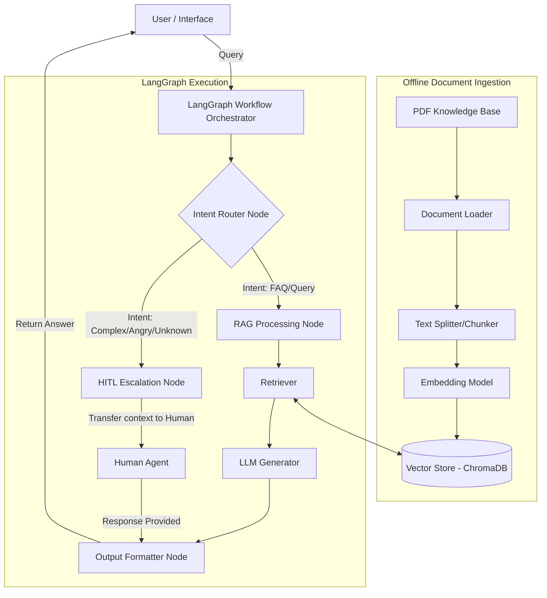

# High-Level Design (HLD)
## RAG-Based Customer Support Assistant (with LangGraph & HITL)

### 1. System Overview
**Problem Definition:**
Customer support teams frequently face a huge volume of repetitive inquiries. While traditional chatbots can serve pre-programmed answers, they struggle with dynamically interpreting policy documents and often fail ungracefully when confronted with complex or angry user intents. They lack the autonomous decision-making capability to escalate seamlessly to human agents while providing contextual background.

**Scope of the System:**
The system will ingest a PDF knowledge base (e.g., store policies, product manuals) and index the embedded data. It will provide a robust conversational interface (CLI or Web UI). By leveraging LangGraph, it manages stateful conversational flows, dynamically determining whether a query can be answered via RAG retrieval or if it necessitates Human-in-The-Loop (HITL) intervention based on the intent, complexity, or system confidence. 

### 2. Architecture Diagram

### 3. Component Description
- **Document Loader:** Responsible for extracting raw text from specialized formats, specifically PDFs handling pagination and encodings.
- **Chunking Strategy:** Splits the document into reasonably sized semantic blocks (e.g., Recursive Character chunks of ~1000 characters with 100 character overlap) to preserve context continuity.
- **Embedding Model:** A neural network (e.g., Google Text Embedding model or OpenAI ADA) mapping chunk strings to dense numerical vectors where semantic similarities imply Euclidean closeness.
- **Vector Store:** ChromaDB, acting as an efficient local nearest-neighbor search index for retrieving chunks aligned to a user query's embedding.
- **Retriever:** Queries the Vector Store and selects Top-K chunks corresponding to the closest distance from the query embedding vector.
- **LLM:** State-of-the-Art Large Language Model (e.g., Gemini-1.5-Pro) that synthesizes a fluid response directly from retrieved chunks while strictly adhering to instructions to avoid hallucination.
- **Graph Workflow Engine:** LangGraph manages dynamic state traversals inside workflows explicitly through "Nodes" (Functions/Execution blocks) and "Edges" (Conditions mapping logical transit).
- **Routing Layer:** A smart decision gateway evaluating user queries against semantic complexity or detected intent.
- **HITL Module:** Freezes control flow. Interrogates an operator for input while surfacing the conversational history, integrating it back into the user-facing thread.

### 4. Data Flow
1. **Ingestion Phase:** Raw PDFs are loaded, split, embedded, and stored offline prior to interaction.
2. **Runtime Query Lifecycle:** 
   - User inputs a prompt.
   - The query enters LangGraph's generic entrypoint and initializes state.
   - The *Intent Router* analyzes the query.
   - *If Standard:* Routes to RAG Retriever -> LLM Generator -> Final State.
   - *If Escalated:* Routes to HITL Escalate -> Human Input acquired -> Appended to context -> Final State.
   - Result is returned to User.

### 5. Technology Choices
- **Why ChromaDB:** It operates locally, reducing external infrastructure dependency and network latency, exceptionally fit for quick prototyping and mid-size corpuses.
- **Why LangGraph:** Unlike legacy linear pipelines (like LangChain Chains), LangGraph provides out-of-the-box state management, cycles (loops), and explicit node-level control logic critical for complex multi-agent or HITL operations.
- **LLM Choice:** Google Gemini 3.1 Pro (via LangChain), due to its exceptional reasoning capability, vast context window, and robust alignment out of the box for handling customer personas securely.
- **Additional Tools:** `pypdf` for universal reliable text extraction, and standard `langchain` modules for standardized API facades.

### 6. Scalability Considerations
- **Handling Large Documents:** Vector stores must be optimized; batch embedding instead of singular synchronous calls. Use advanced strategies like Parent-Document retrieval (embedding small chunks, returning large chunks).
- **Increasing Query Load:** In production, transition out of local ChromaDB to dedicated remote clustered Vector DBs (e.g., Pinecone, Milvus or Qdrant) and place the application behind FastAPI load balancers.
- **Latency Concerns:** Caching repetitive queries (e.g. Semantic Cache) to bypass LLM generation entirely for frequently asked identical intents.
